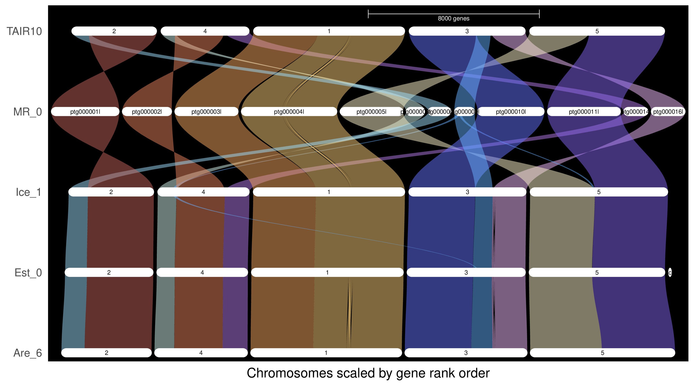

# Part 1 : Transposable Element Annotation and Classification


### Part 1.1 

From the EDTA annotation summary file we obtain the following information : 

```
Repeat Classes
==============
Total Sequences: 611
Total Length: 167017680 bp
Class                  Count        bpMasked    %masked
=====                  =====        ========     =======
LINE                   --           --           --   
    L1                 965          748678       0.45% 
LTR                    --           --           --   
    Copia              880          1220471      0.73% 
    Gypsy              1801         2483947      1.49% 
    unknown            7192         9545186      5.72% 
SINE                   --           --           --   
    tRNA               42           24051        0.01% 
TIR                    --           --           --   
    CACTA              1371         849402       0.51% 
    Mutator            2190         1574713      0.94% 
    PIF_Harbinger      950          412126       0.25% 
    Tc1_Mariner        62           61519        0.04% 
    hAT                1241         552956       0.33% 
nonTIR                 --           --           --   
    helitron           12377        5397860      3.23% 
repeat_fragment        1321         370622       0.22% 
                      ---------------------------------
    total interspersed 30392        23241531     13.92%

---------------------------------------------------------
Total                  30392        23241531     13.92%
```

#### Which TE superfamily is the most abundant in the genome?

Most abundant : Gypsy among the LTR retrotransposons
If we consider _all_ TE types  :  Helitrons (non-TIR DNA transposons) occupy an even larger fraction of the genome (3.23%).

Single largest category overall is : unknown repeats  (5.72%), 
- many TE-derived fragments could not be confidently assigned to a known superfamily.
- common in plant genomes because many TE lineages are old and highly degraded.

#### Are there any differences in TE content between the accessions?

Yes, TE content normally differs between accessions, but we can only confirm differences if we compare each accession’s EDTA summary file.  

### Part 1.2 


#### Are there differences in the number of full length LTR-RTs between the clades?

Yes. Some clades contain many full-length elements, while others contain only a few or none.  
For example:

- In Gypsy, clades like Tekay, Athila, and Retand show many full-length copies.
- In Copia, clades such as Ale, Ivana, and Ikeros are represented, but several clades (e.g. Alesia, Angela, Tork) have only one or very few elements.
    
$\Rightarrow$ proliferation of LTR-RTs is not uniform across clades 
$\Rightarrow$ some lineages have been much more active in this genome than others.


#### Are there any clades with High percent identity (e.g., 99-100%) or young insertions and Low percent identity (e.g., 80-90%) or old insertions?

Yes. Several clades (Tekay, Retand, Athila, Ale, Ivana) show many elements with identities close to 100 percent, indicating very recent insertions. Others (CRM, Angela, Bianca) contain elements with lower identities, consistent with older insertions.


### Part 1.3 

#### Are there any regions with high TE density?

Yes. Several scaffolds show clear regional clustering of TEs, with higher densities toward specific ends or segments of the scaffold.

- ptg000006, ptg000009, ptg000021, and ptg000006l show distinct regions with high TE density, especially in the unknown (green) and Copia (orange) categories.
- we observe the expected anticorrelational pattern between gene density and TE density which is an encouraging result 
  
- The dense green peaks typically suggest older, fragmented TE accumulation, often associated with pericentromeric-like regions 
    
- Some scaffolds show long stretches with _very low_ TE density (e.g., ptg000011), indicating likely gene-rich regions

#### Do the distribution of Gypsy and Copia and other TIR DNA transposons overlap, are there any differences?

Yes, there is partial overlap between Gypsy and Copia, but their distributions are not identical.

- Gypsy elements tend to occur in more localised blocks, often forming short clusters.
- Copia elements show a broader and more dispersed distribution across scaffolds.
- Unknown/other TEs dominate the high-density regions and often overlap with both LTR families.
    
- There are areas where only Copia appears, areas where only Gypsy appears, and regions where both are absent — indicating superfamily-specific insertion preferences or different evolutionary histories

### Part 1.4 Refinement of TE sorter 

Using the final TEanno.gff3 file from EDTA and the clade classification of all TEs from TEsorter can you provide an estimate of the number of Copia and Gypsy elements in each clade? What are the most abundant clades in your genome?


```
Copia SIRE 2

Copia Ale 15

Copia Alesia 1

Copia Tork 8

Copia Bianca 6

Copia Angela 1

Copia Ivana 5

Gypsy CRM 4

Gypsy Reina 11

Gypsy Retand 11

Gypsy Tekay 1

Gypsy Athila 8
```

Copia families are dominated by the Ale (15 families) and Tork (8 families) clades, 
while smaller contributions come from Bianca, Ivana, SIRE, Alesia, and Angela.

Gypsy families are most abundant in the Reina and Retand clades (11 families each), 
followed by Athila (8), CRM (4), and Tekay (1).

### Part 1.7
<p align="center">
  
  
</p>


#### 1. Can you identify recent and ancient TE activity peaks?

Recent activity

You have no strong peak at very low divergence (K < 0.02) or age < ~3–5 MYA
This means:

- No evidence of recent bursts of TE activity.
- Only a very small amount of near-zero divergence material, mostly noise or highly conserved fragments.

This is exactly what you expect for _Arabidopsis thaliana_, which removes young TEs rapidly and has few active families.

Ancient activity

Two pronounced regions appear:

1. Mid divergence peak (K ≈ 0.10–0.20 → ~10–15 MYA)
    This is the main TE burst, shared across many Brassicaceae.
    
2. Older, broad tail (K > 0.25 → ~20–30 MYA)
	Represents highly degraded, ancient insertions, many of them TIR elements and older Gypsy families.

Note : The conversion from divergence to age is very inexact as it relies heavily on the average mutation rate in the conversion formula : insert formula. 

So:
- Major TE activity occurred very roughly 10–25 MYA
- No clear evidence of recent activation.

We also note that there has there have been divergences up to very recently without any sign of subsiding mesning that there are most lkely still mutations happening. 
    

2. #### Are there differences in TE dynamics between the accessions studied in the group?

As we have a large group of different accessions amongst the group, there are some differences depending on the accession. Over all the results for Mr-0 are fairly standart in comparison. There are no major discrepancies between this result and the average result form the group. 

#### 3. How do the TE dynamics differ between Copia and Gypsy elements?

Gypsy :
- Higher total Mbp across nearly all divergence bins.
- Broad, older distribution (more signal at K > 0.20).
- Indicates Gypsy has contributed most of the ancient TE load.

This is the expected pattern in Brassicaceae.

Copia :
- Present but significantly weaker than Gypsy.
- More signal in mid divergence (K ≈ 0.10–0.15).
- Fewer ancient fragments compared with Gypsy.
    
Interpretation
- Gypsy elements dominated past expansions, creating much of the old TE content.
- Copia elements were active but at lower magnitude, and less retention of ancient fragments is typical in Arabidopsis.
- Neither superfamily shows evidence of recent (<5 MYA) bursts.

# Part 2 : Annotation of genes with the MAKER Pipeline

#### 2.1 How many gene models were predicted by MAKER in your genome? 

MAKER predicted 40 275 genes and 49 676 mRNA models in our hifiasm assembly.  

#### 2.2 Is it comparable between accessions in the group and in the reference Arabidopsis thaiana genome?

This is higher than the ∼27 000 genes in the Arabidopsis thaliana reference genome, which is expected at this stage because we used a permissive AED threshold (AED_threshold = 1).  
MAKER therefore retained all models, including weakly supported, redundant, and potentially fragmented predictions.  
In later steps, evidence support and AED-based filtering will reduce this set to a more biologically realistic gene count.


#### 2.3 How can you refine and validate gene annotations generated by MAKER? 

Refinement relies on combining structural evidence, functional evidence and quantitative quality metrics. After MAKER produces the raw annotations, the following steps strengthen and validate the gene set:

- renaming gene IDs to ensure consistent, interpretable identifiers
- adding functional domain evidence with InterProScan
- computing AED values to quantify agreement with transcript and protein evidence
- filtering the GFF to remove unsupported or fragmentary models
- retaining only canonical gene features (gene, mRNA, CDS, exon, UTR)
- subsetting protein and transcript FASTAs to match the filtered GFF

This process reduces false positives, removes weak predictions, and produces a coherent set of biologically supported gene models.


#### 2.4 What is the significance of the Annotation Edit Distance (AED) in assessing the quality of gene annotations? 

AED is a measure of disagreement between a predicted gene model and its supporting evidence.  
It ranges from 0 (perfect support) to 1 (no support).

- AED close to 0 indicates strong agreement with transcript or protein evidence.
- AED between 0 and 0.5 generally indicates acceptable support.
- AED close to 1 suggests that a model is poorly supported and likely incorrect.

In practice, filtering based on AED ensures that only well-supported gene predictions are retained, improving annotation accuracy and reducing spurious models.

#### 2.5 Can functional annotations generated using tools like InterProScan help support the gene prediction?

Yes. Functional domain evidence provides an independent line of support beyond structural prediction.

InterProScan identifies conserved protein domains such as Pfam motifs, which frame the predicted ORF within known biological functions. If a predicted protein contains recognised domains, this:

- increases confidence that the gene model represents a real gene
- helps distinguish genuine protein-coding genes from ORFs produced by noise
- complements AED by adding functional evidence
- highlights incomplete or truncated models when only partial domains are detected

Combining domain evidence with AED and structural evidence results in a more robust and biologically meaningful set of gene annotations.

#### 2.6 What are the key metrics provided by BUSCO for assessing gene annotation quality for your dataset? 

Yes. Functional domain evidence provides an independent line of support beyond structural prediction.

InterProScan identifies conserved protein domains such as Pfam motifs, which frame the predicted ORF within known biological functions. If a predicted protein contains recognised domains, this:

- increases confidence that the gene model represents a real gene
- helps distinguish genuine protein-coding genes from ORFs produced by noise
- complements AED by adding functional evidence
- highlights incomplete or truncated models when only partial domains are detected

Combining domain evidence with AED and structural evidence results in a more robust and biologically meaningful set of gene annotations.


# Part 3 : 

#### 3.1 What proportion of proteins have a significant hit to well-annotated proteins (with curated functions) vs. uncharacterized proteins? 


| Category                  | Count  | %    |
| ------------------------- | ------ | ---- |
| Proteins with UniProt hit | 31 210 | 77.5 |
| Proteins with TAIR10 hit  | 38 707 | 96.1 |
| No homology hit           | 958    | 2.4  |


Approximately 77.5 percent of proteins recovered a significant match to the curated UniProt Viridiplantae database, and around 96 percent aligned to a TAIR10 representative gene model. A small proportion (about 2.4 percent) had no detectable homology under the chosen thresholds. These unmatched proteins may represent shorter or more divergent sequences, annotation artefacts, or potentially accession-specific genes; additional checks would be needed to distinguish between these possibilities.


#### 3.2 Are there length or completeness biases in proteins without UniProt hits (e.g., short fragments)? 

Proteins with UniProt hits had a mean length of 383 amino acids and a median of 325 amino acids, with lengths ranging from 19 to 5 445 amino acids.
Proteins without UniProt hits had a mean length of 242 amino acids and a median of 147 amino acids, with lengths ranging from 1 to 15 253 amino acids.
Within the non-hit group, the largest counts were in the 0–100 amino acid range (3 332 proteins) and the 100–200 amino acid range (2 189 proteins).


#### 3.3 Orthogroup Analysis: How many orthogroups are shared between the accessions and the reference genome? How many are unique to each?

Across the five accessions (Are-6, Est-0, Ice-1, MR-0 and TAIR10), a total of 34 992 orthogroups were identified. Of these, 22 728 orthogroups were shared among all genomes, representing the conserved core set. A further 7 284 orthogroups were present in more than one but not all accessions. Orthogroups found exclusively in a single accession ranged from 542 in TAIR10 to 1 911 in MR-0.

| Category                                           | Count  |
| -------------------------------------------------- | ------ |
| Total orthogroups                                  | 34 992 |
| Orthogroups shared by all accessions (core)        | 22 728 |
| Orthogroups shared by some but not all (accessory) | 7 284  |


| Accession | Unique orthogroups |
| --------- | ------------------ |
| Are_6     | 1 166              |
| Est_0     | 644                |
| Ice_1     | 717                |
| MR_0      | 1 911              |
| TAIR10    | 542                |

#### 3.4 Do you see any major structural rearrangements between accessions?




Across the five Arabidopsis accessions, the riparian plot shows highly conserved synteny with no visible major structural rearrangements. The braids connecting orthologous genes run smoothly between TAIR10 and all other genomes, including MR-0, indicating:
- no large inversions
- no translocations
- no chromosome fissions/fusions
- no major breaks in gene order
Minor local wiggles in the braids reflect small-scale differences in local ordering or annotation boundaries, but no genome-wide structural variation is evident. Overall, the accessions are structurally very similar to TAIR10 at the macroscopic synteny level.


